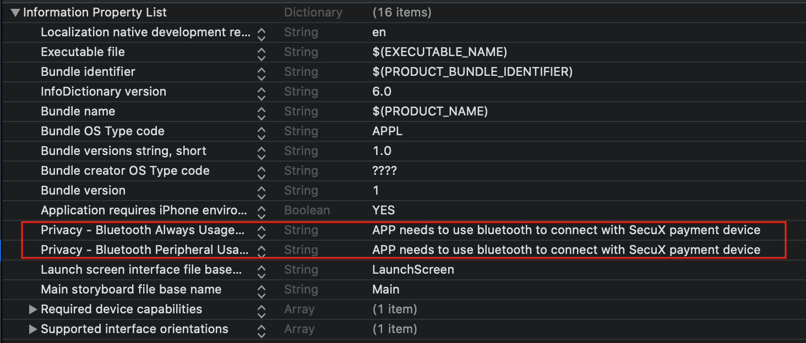

# SecuXPaymentKit

[](https://travis-ci.org/maochuns/SecuXPaymentKit)
[](https://cocoapods.org/pods/SecuXPaymentKit)
[](https://cocoapods.org/pods/SecuXPaymentKit)
[](https://cocoapods.org/pods/SecuXPaymentKit)
[](https://github.com/Carthage/Carthage)

## Example

To run the example project, clone the repo, and run `pod install` from the Example directory


## Usage

### Add bluetooth privacy permissions in the plist



### Import the the module

```swift 
 import SecuXPaymentKit
```

### Use SecuXAccountManager to get account balance and history

```swift
 let accountMgr = SecuXAccountManager()
 let account = SecuXAccount(name: "xxxx", type: .DCT, path: "", address: "", key: "")
 let (ret, balance) = accountMgr!.getAccountBalance(account: account)
 if ret{
     print("Get account balance succssfully! \(balance?.balance ?? 0) USD Balance = \(balance?.balance_usd ?? 0) Balance = \(balance?.formattedBalance ?? 0)")
 }
 
 let (ret, historyArr) = accountMgr!.getAccountHistory(account: account)
 if ret{
     for item in historyArr{
         print("\(item.timestamp) \(item.tx_type) \(item.formatted_amount) \(item.amount_usd) \(item.detailsUrl)")
     }
     
 }
```
getAccountBalance(account: ) returns SecuXAccountBalance object

```swift
 public struct SecuXAccountBalance: Codable {
     public var balance: Double
     public var formattedBalance: Double
     public var balance_usd: Double
 }
```
getAccountHistory(account:) returns SecuXAccountHistory object array

```swift
 public struct SecuXAccountHistory: Codable {
     public var address: String                 //Send to or receive from address
     public var tx_type: String                 //"Send" or "Receive"
     public var amount: Double
     public var amount_symbol: String?          //Coin type, e.g. DCT
     public var formatted_amount: Double
     public var amount_usd: Double
     public var timestamp: String               //YYYY-MM-DD hh:mm:ss
     public var detailsUrl: String              //Transaction details link
 }
 ```


### Use SecuXPaymentManager to get store info. and do payment

* Implement SecuXPaymentManagerDelegate

    **func paymentDone(ret: Bool, errorMsg: String)** 
    Called when payment is completed. Returns payment result and error message.

    **func updatePaymentStatus(status: String)** 
    Called when payment status is changed. Payment status are: "Device connecting...", "DCT transferring..." and "Device verifying..."
    
    **func getStoreInfoDone(ret: Bool, storeName: String, storeLogo: UIImage)**
    Called when get store information is completed. Returns store name and store logo.
    
```swift
 extension ViewController: SecuXPaymentManagerDelegate{
     
     func paymentDone(ret: Bool, errorMsg: String) {
         print("paymentDone \(ret) \(errorMsg)")
     }
     
     func updatePaymentStatus(status: String) {
         print("updatePaymentStatus \(status)")
     }
     
     func getStoreInfoDone(ret: Bool, storeName: String, storeLogo: UIImage) {
         print("getStoreInfoDone")
         
         if ret{
             paymentMgr!.doPayment(account: decentAccount!, storeName: storeName, paymentInfo: self.paymentInfo)
         }else{
             print("Get store info. faied!")
         }
     }
 }
```

* Get store information

```swift
 var paymentMgr = SecuXPaymentManager()
 paymentMgr!.delegate = self

 let paymentInfo = "{\"amount\":\"100\", \"coinType\":\"DCT\", \"deviceID\":\"4ab10000726b\"}"
 paymentMgr.getStoreInfo(paymentInfo: self.paymentInfo)
```

* Do payment

```swift
 paymentMgr.doPayment(account: account!, storeName: storeName, paymentInfo: self.paymentInfo)
```

## Requirements

* iOS 12.0+
* Swift 5.0

## Installation


### CocoaPod

SecuXPaymentKit is available through [CocoaPods](https://cocoapods.org). To install
it, simply add the following line to your Podfile:

```ruby
pod 'SecuXPaymentKit'
```

### Carthage

To integrate SecuXPaymentKit into your Xcode project using Carthage, specify it in your Cartfile file:

```ruby
binary "https://maochuns.github.io/SPManager.json"
github "secuxtech/SecuXPaymentKit"
```

## Demo APP

Please find more in our [demo app](https://github.com/secuxtech/SecuXPayDemo-iOS)

## Author

SecuX, maochunsun@secuxtech.com

## License

SecuXPaymentKit is available under the MIT license. See the LICENSE file for more info.
